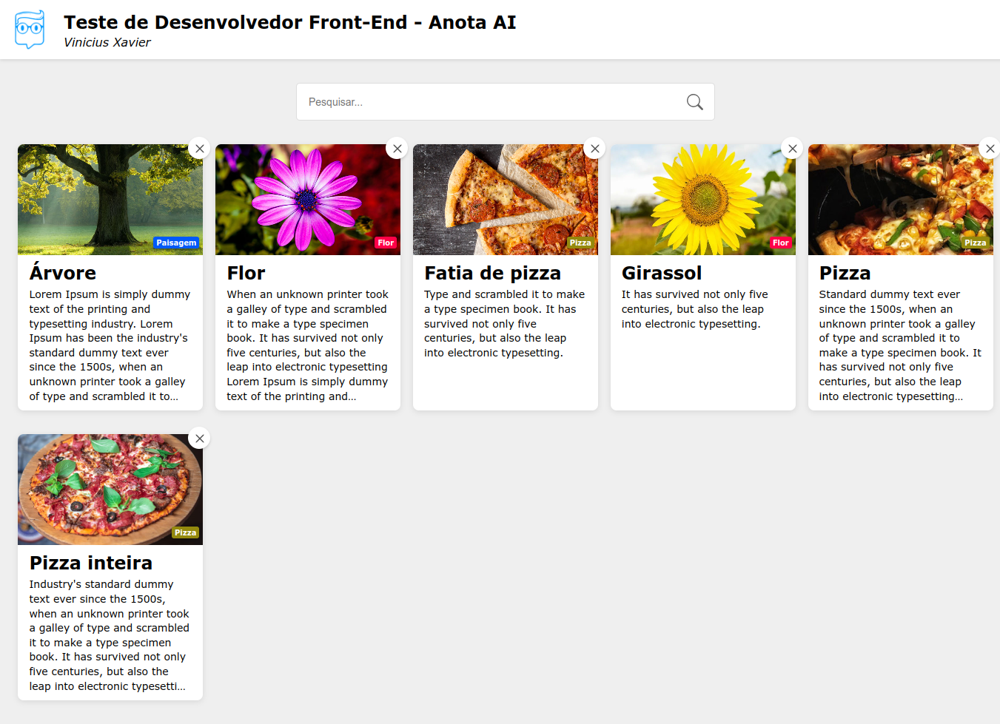

<div align='center'>
  
</div>

# Anota Ai Test

This project was generated using [Angular CLI](https://github.com/angular/angular-cli) version 19.2.4.

👉 [Demo](https://anota-ai-test-three.vercel.app)

## Development server

Install dependencies with `npm`, run:

```bash
npm install
```

To start a local development server, run:

```bash
ng serve
```

Once the server is running, open your browser and navigate to `http://localhost:4200/`. The application will automatically reload whenever you modify any of the source files.

<h3 align='center'>Preview</h3>

<div align='center'>
  
</div>
